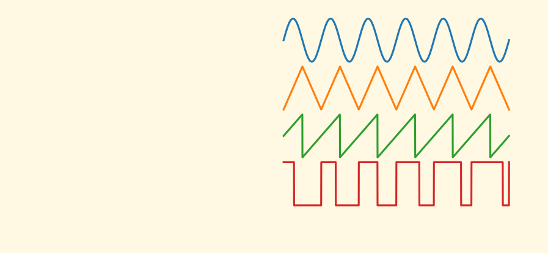

# Det är synd att inte syntha

---

# Innehåll

- Synthesizers
- Ljud och vågformer
- Oscillatorer
- Control voltage
- Filter
- Gate
- Envelop Generator
- Sequencer
- Länkar och resurser
- Demo

---

# Vadå syntesajslar?

- Skapar ljudsignaler från "ingenting", syntetiskt
- Modifierar signalerna genom olika filter och effekter
- Det finns många olika synthesizar
  - Bas, "synth", trummor, trumpeter..
- Analoga och digitala

---

# Modulära synthesizers

- Enskilda funktioner per modul
- Kopplas ihop med patchkablar
- Den som har flest moduler när den dör..

---

# Ljud och vågformer

- Vibration i form av tryckskillnader som propagerar i luften
- Hörbart ljud inom 20 Hz - 20 kHz
- Vågformen påverkar karaktären på ljudet
- Representeras som spänning i en synthesizer

---

# Oscillatorer

- Vanliga vågformer:
  - Sinus
  - Triangel
  - Ramp / Sågtand
  - Fyrkant / Puls
- VCO - Voltage Controlled Oscillator
- LFO - Low Frequency Oscillator

---

# Filter

- Brytfrekvens
- Resonans
- Roligast på vågor med mycket frekvensinnehåll
- LP, lågpass är vanligt

<audio src="" controls />

---

# Envelop Generator & Gate

---

# Control voltage

- Styrsignal som påverkar parametrar
  - VCO: Frekvens, vågform, PWM..
  - VCF: Brytfrekvens, resonans..
  - VCA: Dämpning, balans..
- 0 V - 10 V i Eurorack
- Kan genereras av LFO, Envelope Generators etc.

---

# Sequencer

---

# Länkar och resurser

- VCV Rack - Gratis modularsynthmjukvara
- Make: Analog Synthesizers - Ray Wilson
- Modular Mayhem - Colin Benders

# Demo
